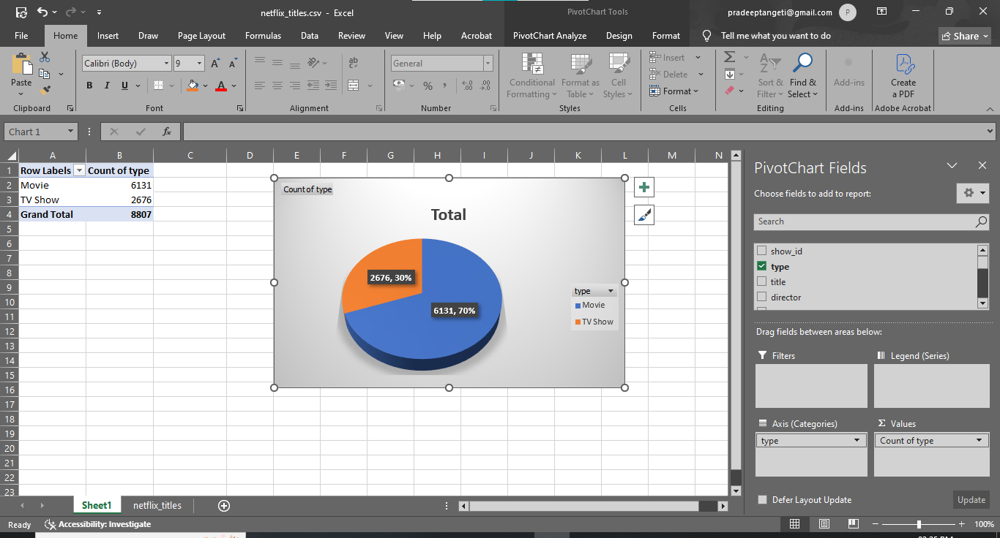
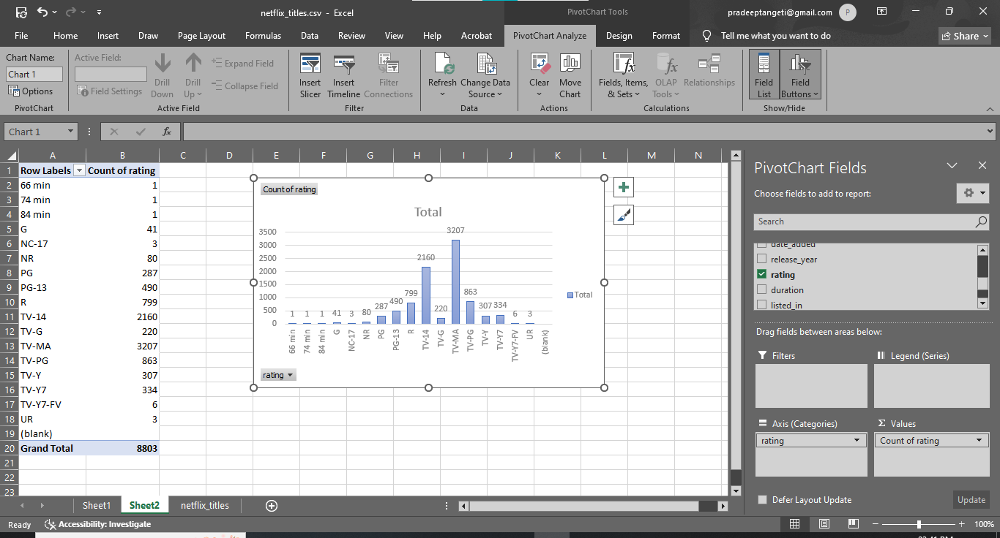
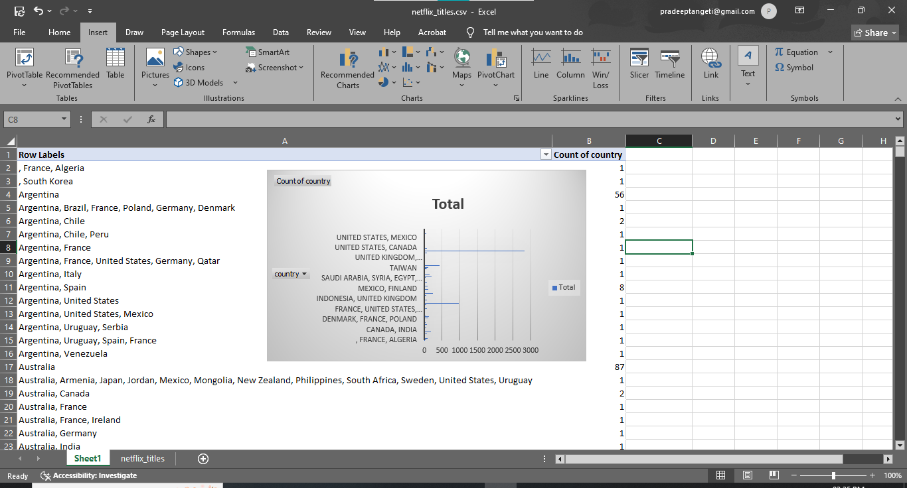
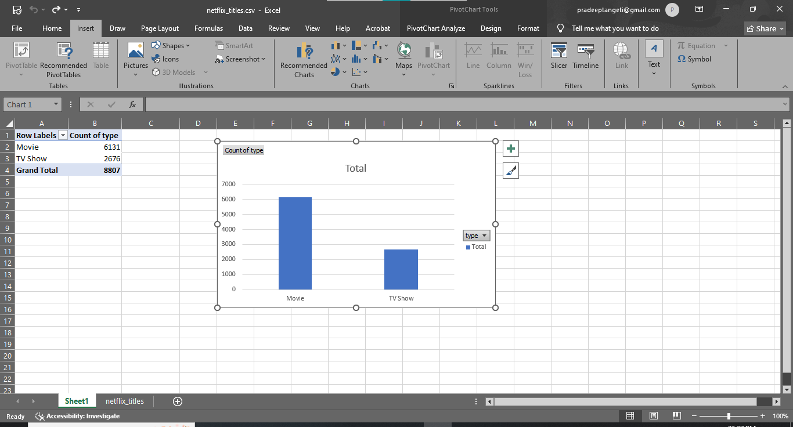

📊 Netflix Data Analysis (Excel Project)

 📌 Overview
This project analyzes a Netflix dataset using Microsoft Excel to uncover insights about content distribution, audience preferences, and production trends.

---

 📂 Dataset
- Source: Kaggle  
- Records: 8808  
- Columns: 12  

---

 🛠 Tools Used
- Microsoft Excel  
- Pivot Tables  
- Data Cleaning  

---

 📊 Key Insights

 Content Distribution
Movies dominate Netflix content (~70%), while TV shows account for ~30%.

 Audience Target
Most content is rated TV-MA, indicating a focus on mature audiences.

 Content Growth
A major spike in content occurred around 2018.

 Top Country
United States leads with 2818 titles.

 Genre Trends
International Drama is the most common genre.

---

 📈 Visualizations

 Content Distribution

 Ratings Analysis

 Country Analysis

 Additional Insight

---

## 🎯 Conclusion
This project demonstrates how Excel can be used for real-world data analysis and insight generation.
